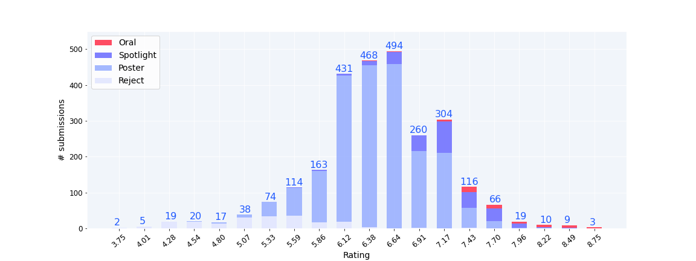
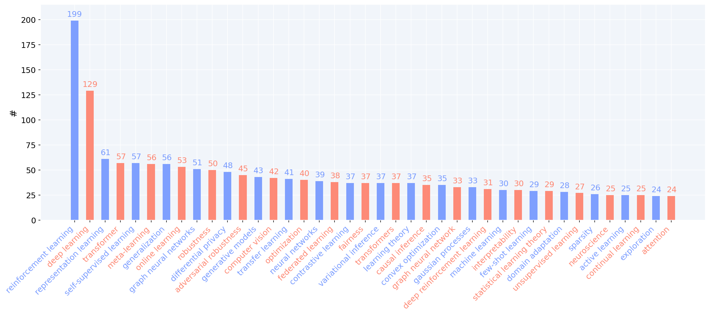
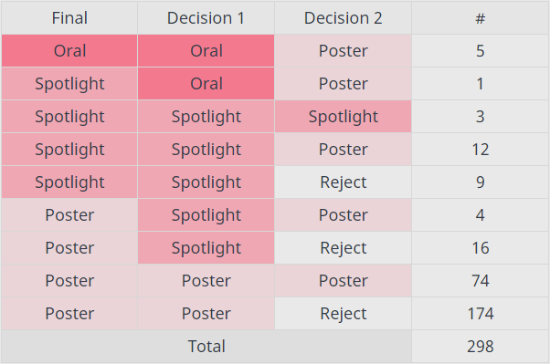

# NeurIPS2021 Statistics

__More detailed data is available [online](https://guoqiangwei.xyz/neurips2021_stats/neurips2021_submissions.html).__

:triangular_flag_on_post:: the statistics are collected only on finally accepted submissions, not all rejected submissions are available.

### All submissions

- `2334` submissions are finally accepted.
- `298(13%)` submissions received two set of reviews.
- `2632(=2334+298)` set of reviews in total.
- `46.36` average rating of all `2632` ratings.
- 
    |Decision|#|rating avg.|rating max|rating min|
    |---|---|---|---|---|
    |Oral|56|7.56|8.75|6.33|
    |Spotlight|282|7.01|8.33|5.50|
    |Poster|2095|6.36|8.00|4.67|
    |Reject|199|5.19|7.33|3.75|
    |Total|2632|6.36|8.75|3.75|
- Ratings distribution

- Top `50` keywords

### Consistency experiment 

- `298` submissions received two set of reviews.
- `221(74%)` submissions received two different decisions.
- `77(26%)` submissions received two consistent decisions.
- `199(67%)` submissions received one `Reject` decision.
- [Details](https://guoqiangwei.xyz/neurips2021_stats/neurips2021_consistency_experiments.html)
  
  

## Acknowledgement 

Some code is motivated by [ICLR2019-OpenReviewData](https://github.com/shaohua0116/ICLR2019-OpenReviewData) and [iclr2022_stats](https://github.com/weigq/iclr2022_stats).
